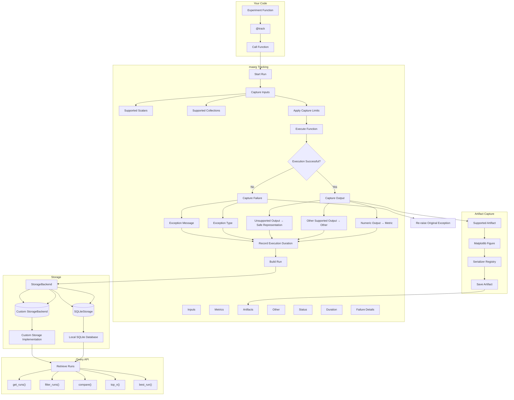

<p align="center"><picture>
  <source media="(prefers-color-scheme: dark)" srcset="https://raw.githubusercontent.com/Moazzam-Matin/maarg/main/docs/assets/maarg_logo_dark.svg">
  <source media="(prefers-color-scheme: light)" srcset="https://raw.githubusercontent.com/Moazzam-Matin/maarg/main/docs/assets/maarg_logo.svg">
  
</picture></p>

<p align="center">
  <strong>Track Experiments with Zero Boilerplate.</strong>
</p>

<p align="center">
  <a href="https://pypi.org/project/maarg/">
    
  </a>
  <a href="https://github.com/Moazzam-Matin/maarg/actions/workflows/ci.yaml">
    
  </a>
  <a href="https://pypi.org/project/maarg/">
    
  </a>
  <a href="https://github.com/Moazzam-Matin/maarg/blob/main/LICENSE">
    
  </a>
</p>

## What is maarg?

`maarg` is a lightweight experiment tracking library for Python built to stay out of your way. With a simple `@track` decorator, it automatically records the information behind your experiments — from inputs and metrics to artifacts, execution time, and failures — so you can understand and compare your runs without adding tracking code throughout your project.

## Start Tracking in 3 Steps

### 1. Install

```bash
pip install maarg
```

If you want artifact capture for Matplotlib figures, install the optional plotting dependencies:

```bash
pip install "maarg[plotting]"
```

### 2. Track your first experiment

Add `@track` to your experiment function and run it as usual. `maarg` automatically captures the supported inputs and the numeric result as a metric, along with execution time and run status.

```python
from maarg import track

@track
def train_model(learning_rate=0.01, epochs=10):
    accuracy = 0.92
    return accuracy

train_model()
```

### 3. Retrieve your runs

Retrieve your tracked runs with the simple query API:

```python
from maarg import get_runs

runs = get_runs(function="train_model")

for run in runs:
    print(run)
```

Your runs are stored locally in SQLite and can be queried, filtered, compared, and ranked using the `maarg` query API.

## Features

### 🎯 Zero-Boilerplate Tracking

Track Python functions with a simple `@track` decorator. No manual logging calls or experiment setup required.

### 📥 Automatic Input Capture

Automatically captures supported function inputs, including scalars and common collections, while safely skipping or limiting unsupported and oversized values.

### 📊 Automatic Metrics

Numeric function outputs are automatically recorded as metrics, making experiment results easy to query and compare.

### 📦 Artifact Capture

Capture supported artifacts such as Matplotlib figures and store them alongside your experiment runs.

### ⏱️ Execution Tracking

Every run records its execution duration, giving you a simple way to understand how long experiments take.

### ❌ Failure Tracking

Failed experiments are recorded with their exception type and message while the original exception is re-raised unchanged.

### 🗄️ Local-First Storage

Runs are stored locally in SQLite by default. No tracking server or external database is required.

### 🔌 Pluggable Storage

Use the built-in `SQLiteStorage` or implement the `StorageBackend` interface to provide your own storage backend.

### 🔎 Query & Compare

Retrieve, filter, compare, and rank experiment runs using `get_runs()`, `filter_runs()`, `compare()`, `top_n()`, and `best_run()`.

### ⚙️ Configurable Capture

Control experiment names, storage, artifact locations, capture limits, and failure behavior through `@track` options.

## How It Works

`maarg` works by wrapping your experiment function with the `@track` decorator. When the function runs, `maarg` observes the execution and automatically captures the information that matters for the run.

### 1. Decorate

Add `@track` to the function you want to track.

```python
@track
def train_model(...):
    ...
```

### 2. Run

Call your function normally. Your experiment code doesn't need to know that `maarg` is tracking it.

```python
train_model()
```

### 3. Capture

During execution, `maarg` captures supported information such as:

* Function inputs
* Numeric outputs as metrics
* Artifacts
* Execution duration
* Run status
* Failure details when an experiment fails

### 4. Store

The completed run is stored locally in SQLite by default:

```text
.maarg/runs.db
```

You can then retrieve and work with your runs through the `maarg` query API.

**Your experiment code stays focused on the experiment. `maarg` handles the tracking.**

## Workflow



## Project Structure

```text
maarg/
├── .github/
│   └── workflows/
│       └── ci.yaml
│
├── docs/
│
├── src/
│   └── maarg/
│       ├── __init__.py
│       ├── _capture.py
│       ├── _convenience.py
│       ├── _exceptions.py
│       ├── _models.py
│       ├── _query.py
│       ├── _tracking.py
│       └── storage/
│           ├── __init__.py
│           ├── _base.py
│           └── _sqlite.py
│
├── tests/
│   ├── test_capture.py
│   ├── test_convenience.py
│   ├── test_models.py
│   ├── test_query.py
│   ├── test_storage.py
│   └── test_tracking.py
│
├── CHANGELOG.md
├── CONTRIBUTING.md
├── LICENSE
├── PLANNING.md
├── README.md
└── pyproject.toml
```

* `src/maarg/` — Core `maarg` package.
* `_tracking.py` — Implements the `@track` decorator and run lifecycle.
* `_capture.py` — Handles input, output, and artifact capture.
* `_models.py` — Core run data model.
* `_query.py` — Query, filter, compare, and ranking logic.
* `_convenience.py` — Storage-aware public query helpers.
* `_exceptions.py` — `maarg` exceptions and warnings.
* `storage/` — Storage abstraction and SQLite implementation.

The `tests/` directory covers tracking, capture, models, querying, convenience APIs, and storage.

## Tracking

The `@track` decorator is the core of `maarg`. Add it to an experiment function and `maarg` automatically records the execution as a run.

### Basic Tracking

The simplest form is:

```python
from maarg import track

@track
def train_model(learning_rate=0.01, epochs=10):
    accuracy = 0.92
    return accuracy
```

Every time `train_model()` runs, `maarg` records a new run.

### Custom Experiment Names

By default, the experiment name is the function name. You can provide a custom experiment name when needed:

```python
@track(experiment="model-training")
def train_model(learning_rate=0.01):
    return 0.92
```

This allows multiple functions to be grouped under the same experiment.

### Tracking Options

`@track` supports additional options for controlling how runs are captured and stored:

```python
@track(
    experiment="model-training",
    storage=storage,
    artifacts_dir="artifacts",
    max_scalar_bytes=1000,
    max_collection_length=20,
    strict=False,
)
def train_model(learning_rate=0.01, epochs=10):
    return 0.92
```

| Option                  | Description                                                                      |
| ----------------------- | -------------------------------------------------------------------------------- |
| `experiment`            | Name used to group related runs. Defaults to the function name.                  |
| `storage`               | Storage backend used to persist the run.                                         |
| `artifacts_dir`         | Directory used for captured artifacts.                                           |
| `max_scalar_bytes`      | Maximum size for captured scalar values.                                         |
| `max_collection_length` | Maximum number of elements captured from supported collections.                  |
| `strict`                | Controls whether successful-run persistence failures raise `MaargTrackingError`. |

### What Gets Recorded

For each tracked execution, `maarg` can record:

* Function inputs
* Numeric outputs as metrics
* Other supported outputs
* Artifacts
* Execution duration
* Run status
* Exception type and message for failed runs

The function itself remains unchanged from the user's perspective: call it normally, receive its normal return value, and handle exceptions as usual.

## Querying

Once your experiments have been tracked, `maarg` provides a simple query API for retrieving, filtering, comparing, and ranking runs.

### Retrieve Runs

Use `get_runs()` to retrieve tracked runs. You can query all runs or narrow the results by function or experiment.

```python
from maarg import get_runs

runs = get_runs()

training_runs = get_runs(function="train_model")

experiment_runs = get_runs(experiment="model-training")
```

### Filter Runs

Use `filter_runs()` to find runs matching specific inputs or conditions.

```python
from maarg import filter_runs

runs = filter_runs(
    function="train_model",
    learning_rate=0.01,
    epochs=10,
)
```

### Compare Runs

Use `compare()` to create a side-by-side view of selected runs.

```python
from maarg import compare

comparison = compare(runs)

print(comparison)
```

### Rank Runs

Use `top_n()` to find the highest- or lowest-performing runs for a metric.

```python
from maarg import top_n

top_runs = top_n(
    runs=runs,
    metric="accuracy",
    n=5,
    higher_is_better=True,
)
```

By default, failed runs are excluded from ranking.

### Find the Best Run

Use `best_run()` when you only need the single best run for a metric.

```python
from maarg import best_run

best = best_run(
    runs=runs,
    metric="accuracy",
    higher_is_better=True,
)
```

### Query API at a Glance

| Function        | Purpose                              |
| --------------- | ------------------------------------ |
| `get_runs()`    | Retrieve tracked runs                |
| `filter_runs()` | Filter runs by inputs and metadata   |
| `compare()`     | Compare selected runs                |
| `top_n()`       | Rank runs and return the top results |
| `best_run()`    | Return the best run for a metric     |

The query API works with both stored runs and in-memory `Run` objects, making it possible to use the same query logic whether runs come directly from storage or from a previous query.

## Storage

`maarg` uses a local-first storage model. By default, tracked runs are stored in a SQLite database inside the `.maarg` directory:

```text
.maarg/
└── runs.db
```

No tracking server or external database is required for the default setup.

### SQLite Storage

The built-in `SQLiteStorage` backend provides persistent local storage for experiment runs.

```python
from maarg import SQLiteStorage, track

storage = SQLiteStorage()

@track(storage=storage)
def train_model(learning_rate=0.01):
    return 0.92
```

You can also provide a custom database path:

```python
storage = SQLiteStorage("experiments.db")
```

### Custom Storage Backends

`maarg` separates tracking logic from persistence through the `StorageBackend` interface.

This allows you to implement your own storage backend without changing how experiments are tracked.

```python
from maarg import StorageBackend, track

class MyStorage(StorageBackend):
    # Implement the required storage methods
    ...

storage = MyStorage()

@track(storage=storage)
def train_model():
    return 0.92
```

The tracking layer remains the same regardless of which storage backend is used.

### Storage Architecture

```text
@track
   │
   ├──────────────► Run Metadata
   │                    │
   │                    ▼
   │              StorageBackend
   │                    ├── SQLiteStorage
   │                    │      └── .maarg/runs.db
   │                    │
   │                    └── Custom StorageBackend
   │
   └──────────────► Artifacts
                        │
                        ▼
                   Artifacts Storage
                        └── .maarg/artifacts/
                               └── <run_id>/
                                      └── *.png
```

Run metadata and artifacts are stored separately: SQLite stores the run information, while captured artifacts are saved in the artifact directory associated with each run.

## Capture & Failure Handling

`maarg` is designed to capture useful experiment information without interrupting the experiment itself.

### Input Capture

`maarg` automatically captures supported function inputs, including:

* Integers, floats, booleans, strings, and `None`
* Lists and tuples
* Dictionaries
* Nested supported collections

To keep stored run data manageable, capture limits are applied to scalar values and collections. Unsupported or complex objects are safely skipped rather than serialized indiscriminately.

### Output Capture

Function outputs are recorded according to their type:

| Output             | Recorded As                   |
| ------------------ | ----------------------------- |
| `int` / `float`    | Metric                        |
| `bool`             | Other                         |
| `str` / `None`     | Other                         |
| Supported artifact | Artifact                      |
| Unsupported object | Safe truncated representation |

Numeric outputs are automatically available as metrics for querying and ranking.

### Artifact Capture

`maarg` supports artifact serializers for objects that can be persisted separately from run metadata.

Currently, Matplotlib figures can be captured as PNG artifacts when the optional plotting dependencies are installed.

Artifacts are stored separately from the SQLite run metadata:

```text
.maarg/
├── runs.db
└── artifacts/
    └── <run_id>/
        └── *.png
```

### Failure Handling

If a tracked function raises an exception, `maarg` records the failed run when possible, including:

* Run status
* Exception type
* Exception message
* Execution duration
* Captured inputs

The original exception is then re-raised unchanged, so adding tracking does not alter normal application error handling.

If persistence of a failed run itself fails, `maarg` emits a `MaargTrackingWarning` and preserves the original exception.

### Strict Mode

By default, `maarg` treats tracking persistence as secondary to your experiment. If a successful run cannot be saved, `maarg` emits a `MaargTrackingWarning` and returns the original function result.

Use `strict=True` when tracking persistence is required:

```python
@track(strict=True)
def train_model():
    return 0.92
```

With strict mode enabled, a failure to persist a **successful run** raises `MaargTrackingError` instead of returning the original result.

For failed experiments, the original exception is always preserved and re-raised. If recording the failed run also fails, `maarg` emits a `MaargTrackingWarning` rather than replacing the original exception.

In short:

| Mode           | Successful run cannot be saved | Failed run cannot be saved            |
| -------------- | ------------------------------ | ------------------------------------- |
| `strict=False` | Warning + return result        | Warning + re-raise original exception |
| `strict=True`  | `MaargTrackingError`           | Warning + re-raise original exception |

## Scope

`maarg` is intentionally focused on lightweight, local experiment tracking.

### What `maarg` Does

The current release focuses on:

* Zero-boilerplate function tracking
* Automatic input and output capture
* Automatic metric capture
* Artifact capture
* Execution timing
* Failure tracking
* Local SQLite storage
* Pluggable storage backends
* Querying, filtering, comparing, and ranking runs

### What `maarg` Does Not Try to Be

`maarg` does not currently provide:

* A tracking server
* A web dashboard
* Distributed or multi-machine experiment tracking
* Authentication or permissions
* A model registry
* Remote storage backends
* Step-wise or imperative metric logging
* Free-form experiment tags
* Workflow orchestration

The goal is to keep the core library small, understandable, and useful without requiring infrastructure around it.

## Roadmap

`maarg` is intentionally evolving around the needs of lightweight experiment tracking.

Potential future areas include:

* Additional storage backends
* Capture hooks and callbacks
* More artifact serializers
* A CLI for common tracking and querying workflows
* Experiment tags and metadata
* Further improvements to querying and comparison
* A separate dashboard or visualization layer

The roadmap is driven by practical use cases and feedback rather than by adding infrastructure for its own sake.

If you have an idea, use case, or limitation you'd like to discuss, contributions and feedback are welcome.

## Contributing

Contributions to `maarg` are welcome.

Before opening a pull request, please:

1. Read `CONTRIBUTING.md` for development and contribution guidelines.
2. Create a focused change that addresses one problem or improvement.
3. Add or update tests for behavioral changes.
4. Run the test suite locally.
5. Keep public APIs and documentation consistent with the implementation.

For larger changes, opening an issue or discussing the proposed approach first can help avoid unnecessary work.

See [`CONTRIBUTING.md`](CONTRIBUTING.md) for the complete contribution workflow.

## License

`maarg` is licensed under the Apache License 2.0.

See [`LICENSE`](LICENSE) for the full license text.
